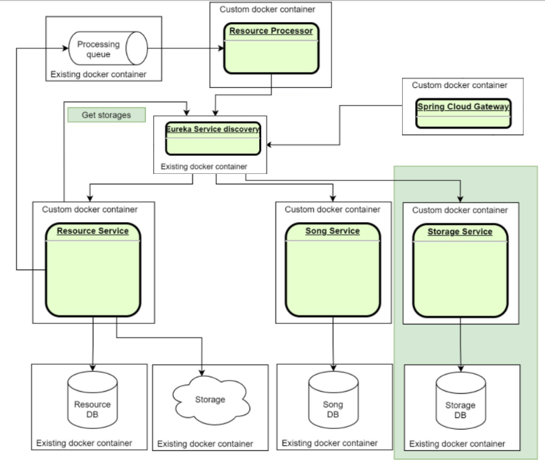

# Run microservices as a whole

Set environment variables for AWS:

```
export AWS_ACCESS_KEY_ID = your access key id
export AWS_SECRET_ACCESS_KEY = your secret access key
```

### Start microservices

- Run development environment:
```
docker-compose -f docker-compose.yaml --env-file .config/.env.dev up
```
- Run production environment:
```
docker-compose -f docker-compose.yaml --env-file .config/.env.prod up
```

### Stop microservices

Choose corresponding environment file:
```
docker-compose -f docker-compose.yaml --env-file .config/.env down
```

### Examples
- Post a resource
```
curl --location --request POST 'http://localhost:8771/resources' \
--form 'multipartFile=@"/Users/Yusuf_Murodov/Downloads/mpthreetest.mp3"'
```

- Get a resource
```
curl --location 'http://localhost:8771/resources/#saved_resource_number' \
--header 'Accept: application/octet-stream'
```

- Delete a resource
```
curl --location --request DELETE 'http://localhost:8771/resources?id=#saved_resouce_number'
```

# Microservice architecture



